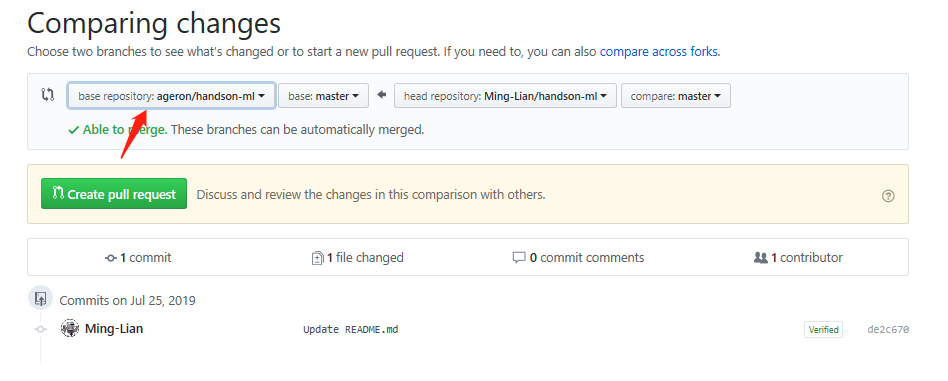
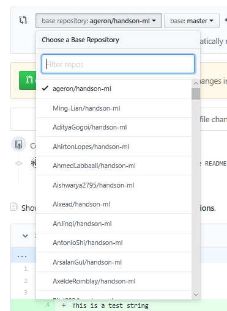

## 题目发布

<a name="content">目录</a>

- [项目说明](#introduction)
- [Q&A](#question-and-answer)
- [入门题](#for-beginer)
    - [1. RNA序列翻译成蛋白质](#for-beginer-1)
    - [2. 获得反向互补序列](#for-beginer-2)
    - [3. 根据序列ID，提取目标序列](#for-beginer-3)
    - [4. 双端未匹配数据的重新匹配](#for-beginer-4)
    - [5. 将输入的大Fasta文件拆分成若干个小Fasta文件](#for-beginer-5)
- [进阶题](#for-user-with-middle-level)
    - [1. 从Fastq文件中随机抽样一定量的数据](#for-user-with-middle-level-1)
    - [2. 将输入的大矩阵文件按照列拆分成若干个sub-matrixs文件](#for-user-with-middle-level-2)
    - [3. 将若干个单样本的表达定量结果汇总成一个大矩阵，即expression profile matrix](#for-user-with-middle-level-3)
    - [4. 利用Needleman–Wunsch 算法来编写一个简单的全局比对程序](#for-user-with-middle-level-4)

- [挑战题](#for-veterans)
    - [1. 分层Bootstrap抽样](#for-veterans-1)

<a name="introduction"><h2>项目说明 [目录](#content)</h2></a>

在IT圈中，LeetCode（中文名：力扣）是每一个程序猿修炼内功的闯关平台，几乎每一位程序员在顺利拿到IT大厂的offer之前，都被里面的各种数据结构与算法题虐过千百遍，但是正所谓不疯魔不成佛，每一个编程大牛都是在与一个一个编程任务和一个一个bug调试的斗争中逐渐成长起来的

与那些真正的动不动就写一个游戏，啪啪敲出成千上万行代码，而且还要考虑系统的稳健性和性能优越性的真程序猿相比，我们这些稍微懂点编程的生物狗，的确是一种非常辣鸡的存在

不过，也不要妄自菲薄，不是我们不行，而是我们工作生活中遇到的场景和他们不一样导致的，和他们相比，我们对系统的稳健性和性能优越性要求不高，基本上能把我要完成的数据分析任务搞定，那就是一个可行的编程解决方案，至于它的所谓时间复杂度与空间复杂度，不是需要我们考虑太多的东西，也没有所谓的用户或者产品经理给你提出比较尖酸刻薄的需求，没有压力，也就没有动力，所以慢慢的成了一条咸鱼

但是，只要你有一颗积极向上的心，只要还不想成为一个实验室的弱鸡搬砖人员，你的目标是星辰大海，既然外界不给咱们压力，那咱们就自己给自己造点压力——

<strong>朋友们，来接受编程的挑战吧</strong>

<a name="question-and-answer"><h2>Q&A [目录](#content)</h2></a>

1. **对编程语言有什么要求？**

    理论上，不限定使用的编程语言，只要能够实现特定的功能即可

    虽然理论上对于某一特定的功能，不同的编程语言都能有实现的方案，不过每种编程语言都有各自的特点属性，为某一类编程场景而设计，因此在实现同一功能上效率有高低之分

    对于生信领域的从业人员来说，比较常用的是：Perl+Python+Shell+R，这几门语言的特点为：

    - `Perl`：强大的纯文本处理能力，正则表达式功能强大，但缺点是不擅长数值计算；
    - `Python`：一种在语法上最接近伪代码的高级语言，而且开发社区非常活跃，文本处理能力接近Perl，而且在使用`Numpy`和`pandas`模块后，具有了R中处理矩阵和数据框的能力，使用`matplotlib`模块后，具有了类似于R中用ggplot2绘图的能力——简而言之，`Python`≈`Perl`+`R`；
    - `Shell`：直接与Linux内核打交道，所以在Linux命令行很实现的简单命令，组合一下就是一个Shell脚本，而且有一些比较简单但功能强大的文本处理命令，比如：`grep`、`sed`、`awk`、`cut`等；
    - `R`：R就是专门为数值计算设计的，能够处理矩阵和数据框类型的数据结构，ggplot2能够将计算的结果进行友好的可视化展示——简而言之，R=计算+可视化；

    还有一个比较个人化的原因是：hub主目前会的编程语言基本就是这4门，所以给出来的示例代码就是用这4门语言编写的，建议大家拿这四门语言来完成这里的编程挑战

2. **怎么提交结果？怎么评估对错？**

    LeetCode是提供代码提交界面，而且运行提交的代码的后台服务器中运行，来得到运行结果，根据运行结果的对错，以及运行效率来给出打分

    but

    咱们没有这个条件，所以，我们会给出参考代码和测试数据，你可以用我们给出的参考代码处理我们给的测试数据得到参考结果，将你编程的代码处理得到的结果与参考结果进行比较（用md5sum命令，比较两个文件的md5值），若结果差不多，那基本上你编写的脚本就是没问题的了

    若你觉得你解决了某一个题目，欢迎将你的答案发到这个项目的issue里，让大家看看你的代码，若写得好，可以让大家学习学习，若有一些错误，也方便大家帮你挑出来

3. **可以提交题目吗？提交题目有什么要求？怎么提交？**

    当然了，而且非常欢迎，依据hub主的一己之力是不可能把这个项目办好的，毕竟自己精力有限，而且遇到的编程场景也比较有限

    我们对提交的题目的要求：

    - 首先，得和生物信息数据分析场景有关系；
    - 需要描述出你的问题，具体描述方式请参考目前已经给出的题目；
    - 给出你的编程解决思路；
    - 给出你的测试数据；
    - 给出你的示例代码（请把注释信息写清楚，方便大家阅读你的代码）；

    最后就是提交方式了
    
    - 首先，你要Fork一下咱们这个仓库

    

    - 然后，直接在你Fork的那个分支仓库下编辑对应的文件
    
        - 描述问题，请在`Questions.md`下编辑，需要给出测试数据的链接，并在这部分的结尾部分，附上定向到“编程解决思路”的链接；
        - 编程解决思路，请在`How2Deal.md`下编辑并在这部分的结尾部分，附上定向到“示例代码”的链接；
        - 测试数据，请提交到`Attachment`文件夹下；
        - 示例代码，请提交到`Answers`文件夹下；

    - 做好上面的编辑后，将其提交到主分支
    
        点击提交按钮：

        

        设置你要提交到哪个目标分支上

        

        选择初始分支，即`base repository`

        

        最后，点击点击提交按钮，完成提交

        

        剩下的便是等待hub主的审核了

<a name="for-beginer"><h2>入门题 [目录](#content)</h2></a>

<a name="for-beginer-1"><h3>1. RNA序列翻译成蛋白质 [目录](#content)</h3></a>

> 给定：氨基酸密码子表，和一个保存多条RNA序列的Fasta文件
>
> 任务：得到RNA序列翻译得到的氨基酸序列，保存为Fasta文件

<a name="for-beginer-2"><h3>2. 获得反向互补序列 [目录](#content)</h3></a>

> 给定：一条DNA序列
>
> 任务：得到这条DNA序列的反向互补序列

<a name="for-beginer-3"><h3>3. 根据序列ID，提取目标序列 [目录](#content)</h3></a>

> 给定：一个[fastq/fasta文件](./Attachments/R1.fastq)，以及另外一个保存目标序列的[id list文件](./Attachments/R1.interested.id)
>
> 任务：从fastq/fasta文件中，根据目标序列的ID，提取出目标序列保存为一个新的fastq/fasta文件

查看解题思路，[点这里](./How2Deal.md#for-beginer-3)

**友情提示**：请先尝试自行解决，然后再查看解题思路和示例代码

<a name="for-beginer-4"><h3>4. 双端未匹配数据的重新匹配 [目录](#content)</h3></a>

> 给定：一个样本的双端测序文件（Attachments文件夹下的R1.fastq和R2.fastq），且这双端Forward-end与Reverse-end同一行的序列并非如标准PE数据那样一一对应，即来源于同一个fragment
>
> 任务：只保留有双端序列的fragment，输出到处理后的双端Fastq文件，且让它在两个fastq文件的同一行一一对应

查看解题思路，[点这里](./How2Deal.md#for-beginer-4)

**友情提示**：请先尝试自行解决，然后再查看解题思路和示例代码

<a name="for-beginer-5"><h3>5. 将输入的大Fasta文件拆分成若干个小Fasta文件 [目录](#content)</h3></a>

给定：一个包含有大量序列的Fasta文件

任务：将该Fasta文件均匀拆分成若干个子Fasta文件，使得每个子文件中的序列条数相同（允许最后一个子文件的序列条数少一些），且提供两个拆分选项：

- 每个子文件的序列条数；
- 拆分得到的子文件的个数；

使得用户可以根据两个选项中的一个进行拆分

<a name="for-user-with-middle-level"><h2>进阶题 [目录](#content)</h2></a>

<a name="for-user-with-middle-level-1"><h3>1. 从Fastq文件中随机抽样一定量的数据 [目录](#content)</h3></a>

给定：双端FASTQ文件

任务：按照用户指定的数据量，即多少bp，从原始的双端FASTQ文件中随机抽取序列，要求双端FASTQ文件中的序列必须配对

<a name="for-user-with-middle-level-2"><h3>2. 将输入的大矩阵文件按照列拆分成若干个sub-matrixs文件 [目录](#content)</h3></a>

给定：给定一个大矩阵，行是features（基因或转录本），列是样本

任务：将该大矩阵按照列均匀拆分成若干个子sub-matrixes，使得每个子文件中的列数相同（允许最后一个子文件的列数少一些），且提供两个拆分选项：

- 每个子文件的列数；
- 拆分得到的子文件的个数；

使得用户可以根据两个选项中的一个进行拆分

<a name="for-user-with-middle-level-3"><h3>3. 将若干个单样本的表达定量结果汇总成一个大矩阵，即expression profile matrix [目录](#content)</h3></a>

给定：保存在同一个文件夹下的若干个单样本的表达定量文件（[测试数据](./Attachments/Samples_profile.tar.gz)，请下载后请先用`tar zxvf`命令解压），即有n行2列，每一行表示一个基因/转录本的定量，第一列每个基因/转录本的ID，第二列是对应基因/转录本在该样本的定量值，且每个文件的命名形式为：`sample+suffix`，即`样本名+固定后缀`

| GeneID | Quant |
|:---:|:---:|
| g1 | 12 |
| g2 | 44 |
| ... | ... |

任务：将将若干个单样本的表达定量结果汇总成一个大矩阵

要求：使用Perl、Python或R编写，从头实现，不允许调用现成的包或工具模块
<a name="for-user-with-middle-level-4"><h3>4. 利用Needleman–Wunsch 算法来编写一个简单的全局比对程序 [目录](#content)</h3></a>

给定：两条序列，核酸或者蛋白质

任务：求两条序列的最优比对方案以获得最大相似度
查看解题思路，[点这里](./How2Deal.md#for-user-with-middle-level-4)

<a name="for-veterans"><h2>挑战题 [目录](#content)</h2></a>

<a name="for-veterans-1"><h3>1. 分层Bootstrap抽样 [目录](#content)</h3></a>
